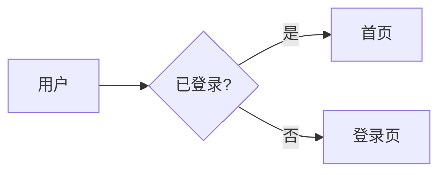
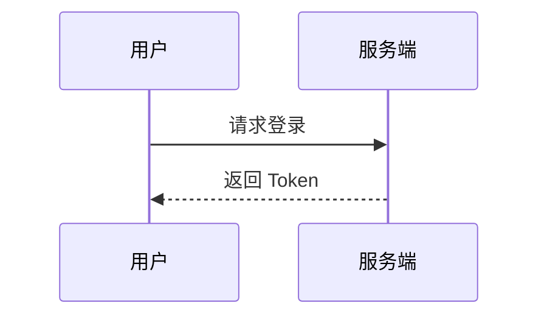

下面应该是一张流程图：

```mermaid
flowchart LR
  A[用户] --> B{已登录?} -->|是| C[首页]
  B -->|否| D[登录页]
```

下面应该是一张时序图：

```mermaid
sequenceDiagram
  participant U as 用户
  participant S as 服务端
  U->>S: 请求登录
  S-->>U: 返回 Token
```
